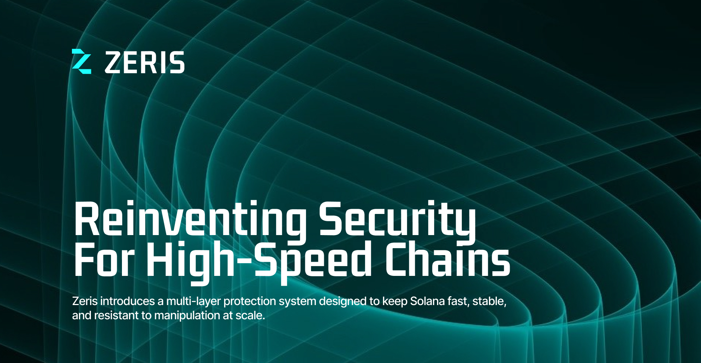

# Zeris Monorepo

**Zeris — Zero-Knowledge Resolution & Integrity System**

A production-grade Solana program and SDK suite for zero-knowledge proof verification and integrity management.

## Architecture

This monorepo contains:

- **programs/zeris-validator**: Anchor-based Solana program for zk-proof verification
- **sdk/typescript**: TypeScript SDK with client, proof builder, and CLI
- **sdk/rust**: Rust SDK for backend services
- **docs/**: Comprehensive documentation
- **examples/**: Working integration examples
- **deploy/**: Deployment automation scripts

## Quick Start

### Prerequisites

- Rust 1.70+
- Node.js 18+
- Anchor 0.28+
- Solana CLI 1.16+

### Installation

```bash
git clone https://github.com/ZerisTeam/zeris-sdk.git
cd zeris-sdk
```

### Build the Program

```bash
cd programs/zeris-validator
anchor build
```

### Install SDKs (TypeScript, Rust, Python placeholder)

Follow the steps below to install each SDK and example. These commands assume you have the prerequisites from above installed (Node.js, Rust, Anchor, Solana CLI).

1) TypeScript SDK

```bash
cd sdk/typescript
npm install
npm run build
```

2) Node.js TypeScript example (uses local SDK)

```bash
cd examples/node-ts-example
# installs the example and the local SDK via the file: reference in package.json
npm install
npm run build
npm start
```

3) Rust SDK

```bash
cd sdk/rust
cargo build
```

4) Solana program (build with Anchor)

```bash
cd programs/zeris-validator
anchor build
```

5) Python (placeholder requirements)

```powershell
cd $PSScriptRoot
python -m pip install -r requirements.txt
```

Note: a Python SDK is not yet implemented in this repository. `requirements.txt` is provided as a convenience placeholder for any Python examples or scripts you may add.

## Documentation

See [docs/README.md](docs/README.md) for comprehensive documentation.

## Examples

- [Node.js TypeScript Example](examples/node-ts-example/)
- [Rust Example](examples/rust-example/)
 - [Python Example](examples/python-example/)

## Deployment

See [deploy/scripts/](deploy/scripts/) for automated deployment scripts.

## Python example

See `examples/python-example` for a minimal Python example that uses `solana-py` to query an RPC endpoint and fetch a balance. Run it in PowerShell using the steps in `examples/python-example/README.md`.

## Automated install script

There are convenience scripts to install/build everything in the repo:

- PowerShell: `scripts\install-all.ps1`
- Bash: `scripts/install-all.sh`

Run the PowerShell script on Windows (run as Administrator if required):

```powershell
cd d:\Project\SDK-DATA\zeris-sdk\scripts
.\install-all.ps1
```


## Contributing

1. Fork the repository
2. Create a feature branch
3. Make your changes
4. Run tests: `anchor test`
5. Submit a PR

## License

MIT